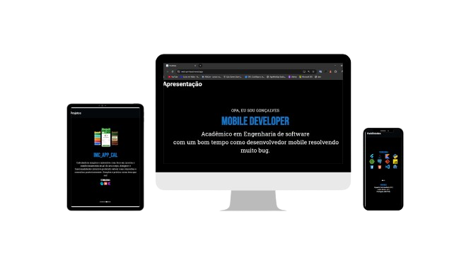

<h1>Flutter Portfólio</h1>

## 📖 Resumo:

Este projeto é um portfólio digital desenvolvido em Flutter, com o objetivo de apresentar meu trabalho, habilidades e experiências do desenvolvedor Flutetr, com uma plaicação  interativa e responsiva. O portfólio pode ser acessado em múltiplas plataformas, proporcionando uma experiência consistente tanto em dispositivos móveis quanto na web.

Irei está melhorando o projeto a cada versão buscando aplicar os melhores recursos do framework **Flutter** trazendo uma experiência amigável e uma apresentação sólida das minhas habilidades.

## ⛓ Estrutura do Projeto

- 📂 **lib/**: Código principal da aplicação Flutter.
- 📂**assets/**: Imagens, ícones e outros recursos estáticos.
- 📦**web/**: Arquivos específicos para deploy web.
- 📑 **pubspec.yaml**: Gerenciamento de dependências e configurações do projeto.

## 💻 Tecnologias Utilizadas

- **Flutter**: Framework principal para desenvolvimento multiplataforma.
- **Dart**: Linguagem de programação utilizada pelo Flutter.
- **GitHub Actions**: Ferramenta de CI/CD para automação de testes e deploy.
- **Netlify/Vercel/Firebase Hosting**: Plataformas de deploy para a versão web.

## 🚀 CI/CD

O projeto utiliza **GitHub Actions** para:

- Rodar testes automatizados a cada push.
- Build automatizado para web e mobile.
- Deploy contínuo para a plataforma de hospedagem escolhida.

## 🌍 Deploy

A aplicação está hospedada na Plataforma Vercel, permitindo fácil acesso e atualização contínua.
Confira o deploy aqui : [Portifólio](https://web-psi-hazel.vercel.app/) 🔍

## 👨‍💻 Desenvolvedor

Projeto desenvolvido por **[José Gonçalves]** [LinkedIn](https://www.linkedin.com/in/jgoncalvessf/) | [GitHub](https://github.com/JoseGoncalvess).  

